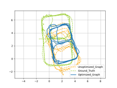
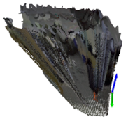

# RGB-D_SLAM_Freicar2

## Description
This repository implements a pipeline for graph-based SLAM, using data from a RGBD camera (Stereolabs ZED2) for loop closure detection, scan matching and point cloud creation and a tracking camera for pose estimation (Intel Realsense T265) and a VIVE tracker for ground truth information. Graph optimization is done using g2o.\
The project was realized during the [FreiCAR](http://freicar.informatik.uni-freiburg.de/) lab course of University of Freiburg.

## Usage
The rosbag should be placed in `src/rosbags` and its name should be given in the config.json. Also in the `config.json` thresholds after which a new pose for the pose graph should be sampled (currently we only use a translation threshold). Make sure that the transforms published in the rosbag match the frames as specified in `class FreiCAR2` of `utils/freicar_representation.py` and elsewhise adapt them.
Script `src/pipeline.py` lists all functions that must be run one after the other to arrive from a rosbag at an optimized pose graph and a fused coloured point cloud. Note that these functions usually have parameters that must be tuned to the individual dataset to achieve decent results. These functions also offer the option to visualize their results. Also it is likely that the guess for the information matrices in `src/g2o/csv_to_g2o_dataset.py` needs to be adapted as we are currently not using the real information matrices. 
While running the pipeline the produced data will be stored in a subdirectory of `src/data` that is named according to the bag and the chosen thresholds for sampling new poses. Be aware that the data extraction from the rosbag must not be interrupted, if this is the case the created folder in `data` has to be deleted and the function has to be run again.

Topics recorded in and used from the rosbag:\
`/freicar_2/zed/left/image_rect_color`\
`/freicar_2/zed/depth/depth_registered`\
`/freicar_2/zed/left/camera_info`\
`/freicar_2/t265/odom/sample`\
`/tf`\
`/tf_static`

## Requirements
We have been using ROS Noetic. For installation of the g2o optimizer we provided an approach that worked for us in `README_SETUP_G2O`.
Any further requirements can be installed from `requirements.txt`.

## Potential improvements
### minor
- use rotation threshold for pose sampling
- register point clouds in ZED center frame (instead of left camera frame), saves handling of left camera frame for pose tracking
- split the loop closure detection (ORB) and scan matching (RANSAC + ICP) step, storing intermediate results from scan matching to run and tune them separately.
- enable the pipeline to run without VIVE tracker data available (e.g. without ground truth). This would only require an adaptation of method `get_transform_world_odom_frame()` method of `class FreiCAR2` and making the use of ground truth data for plotting optional everywhere along the pipeline. 

### major
- use enhanced odometry by scan matching of ZED2 RGBD data in addition to the odometry provided by the T265 tracking camera.
- use real information matrices from T265 odometry and ICP results for graph optimization via g2o

## References
- Grisetti, Giorgio & Kümmerle, Rainer & Stachniss, Cyrill & Burgard, Wolfram. (2010). A tutorial on graph-based SLAM. IEEE Transactions on Intelligent Transportation Systems Magazine. 2. 31-43. 10.1109/MITS.2010.939925.
- R. Kümmerle, G. Grisetti, H. Strasdat, K. Konolige and W. Burgard, "G2o: A general framework for graph optimization," 2011 IEEE International Conference on Robotics and Automation, Shanghai, China, 2011, pp. 3607-3613, doi: 10.1109/ICRA.2011.5979949.
- Thomas Cohn and John Rosner “Large-Scale Mapping with Loop Closure” (https://tommycohn.com/projects/graphslam.html) 
- Qian-Yi Zhou, Jaesik Park, Vladlen Koltun: "Open3D: A Modern Library for 3D Data Processing", 2018 (http://www.open3d.org/docs/release/index.html)

## License

The code is provided under the MIT License.

Copyright 2023 Shikha Tiwari, Philipp Bordne, Mahmoud Khater

Permission is hereby granted, free of charge, to any person obtaining a copy of this software and associated documentation files (the "Software"), to deal in the Software without restriction, including without limitation the rights to use, copy, modify, merge, publish, distribute, sublicense, and/or sell copies of the Software, and to permit persons to whom the Software is furnished to do so, subject to the following conditions:

The above copyright notice and this permission notice shall be included in all copies or substantial portions of the Software.

THE SOFTWARE IS PROVIDED "AS IS", WITHOUT WARRANTY OF ANY KIND, EXPRESS OR IMPLIED, INCLUDING BUT NOT LIMITED TO THE WARRANTIES OF MERCHANTABILITY, FITNESS FOR A PARTICULAR PURPOSE AND NONINFRINGEMENT. IN NO EVENT SHALL THE AUTHORS OR COPYRIGHT HOLDERS BE LIABLE FOR ANY CLAIM, DAMAGES OR OTHER LIABILITY, WHETHER IN AN ACTION OF CONTRACT, TORT OR OTHERWISE, ARISING FROM, OUT OF OR IN CONNECTION WITH THE SOFTWARE OR THE USE OR OTHER DEALINGS IN THE SOFTWARE.
